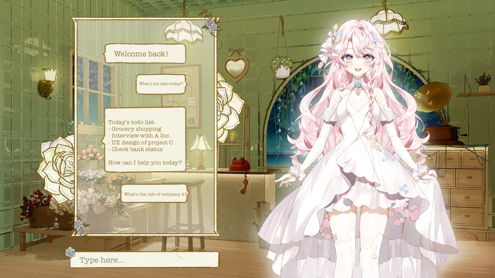

# AI Companion - Lyna

## Overview

Lyna is an AI companion designed to provide emotionally intelligent interactions and personalized experiences through conversation memory. It integrates Meta's LLaMA3 for nuanced dialogue and Live2D for dynamic emotional expressions.

## Features

- **Fine-Tuned LLaMA3 AI**: Customized local LLM for better speed.
- **Live2D Emotional Animation**: Displays emotions in response to user interactions.
- **Persistent Memory**: Retains conversational context for personalization.
- **Unity Development**: Facilitates seamless integration of components.
- **VITS Text-to-Speech**: Creates a natural and emotive voice output.

## Tech Stack

- **Language Model**: Meta's LLaMA3
- **Animation**: Live2D
- **Development Platform**: Unity
- **Voice Synthesis**: VITS Text-to-Speech
- **Database**: ChromaDB for data management and recall

## UI Design

## Progress

The project is in the design stage with UI mockups prepared. The next steps include the integration of the AI model, emotional response system, and memory functions.
